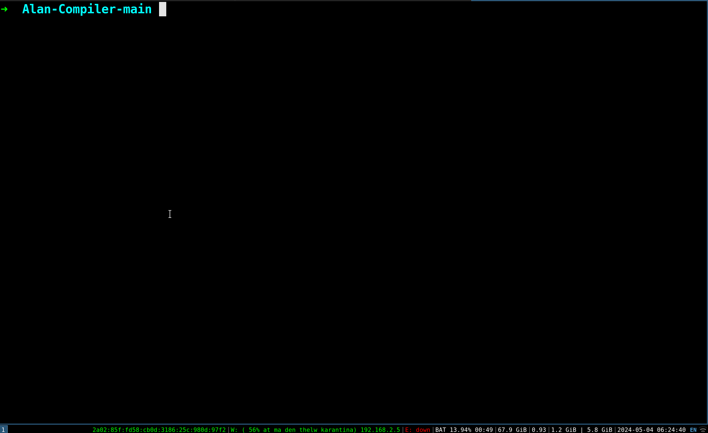
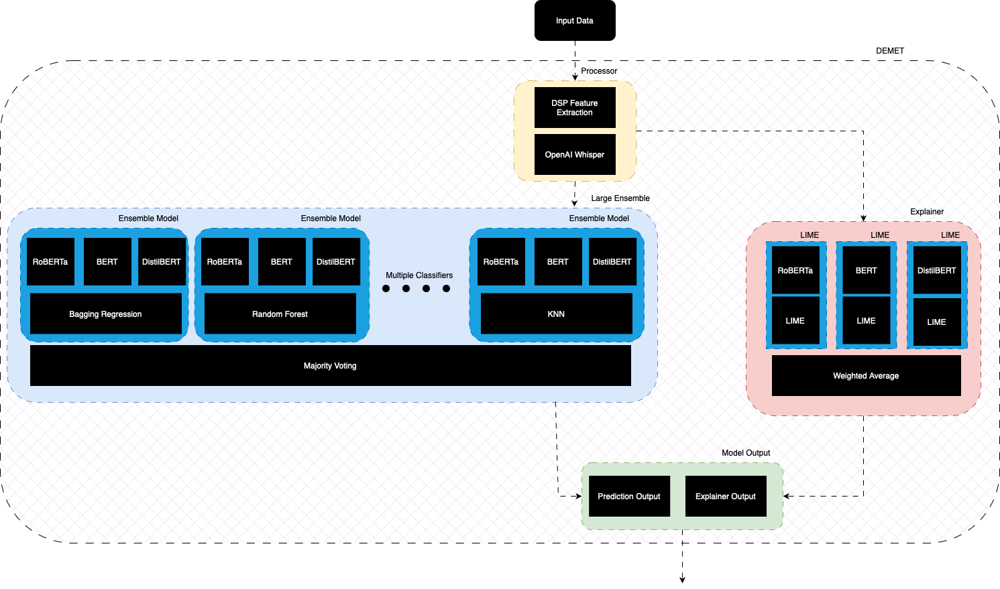
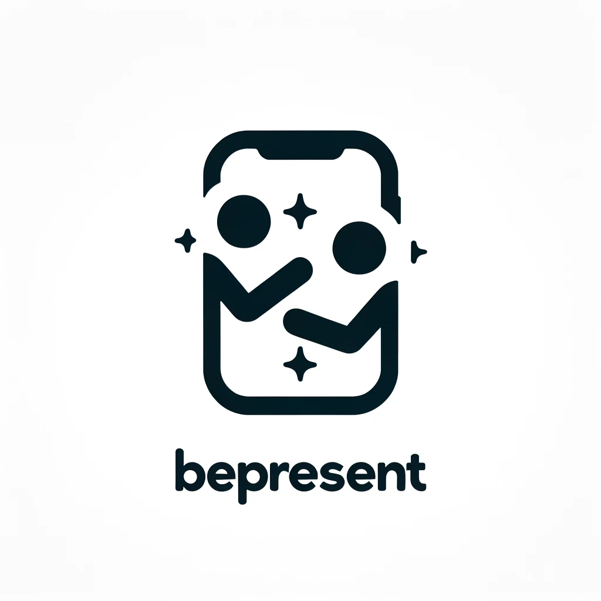

  

    
    <h3><a href="https://github.com/peter-avg/Alan-Compiler">Alan Compiler</a></h3>
    
A compiler for the Alan Programming Language in C++14, using Flex for lexical analysis, Bison for
parsing tokens into syntactically valid constructs and LLVM for generating optimized bytecode across multiple target
architectures.

  

  

    
    <h3><a href="https://github.com/peter-avg/DEMET">DEMET</a></h3>
    
DEMET, or Dementia Explainable Transformer, is a cognitive assessment agent that serves as a pre-diagnostic tool in clinical practice.

  

  

    
    <h3><a href="https://github.com/peter-avg/BlockChat">BlockChat</a></h3>
    
Welcome to BlockChat, a comprehensive blockchain application built entirely in Golang. This application showcases a decentralized blockchain system with CLI and Webapp interfaces, allowing users to join the blockchain network, send messages or Bitcoin, and engage in transactions with the assurance of a Proof of Stake validation mechanism.

  

  

    
    <h3><a href="https://github.com/peter-avg/BePresentApp">BePresent</a></h3>
    
A full-stack mobile application to NOT use your phone while with friends. Enjoy life, Be Present.

  

